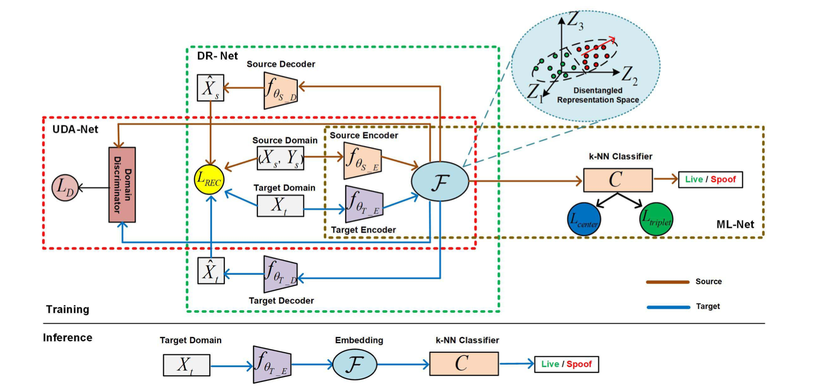

# DR-UDA
This is the source code for paper ”Unsupervised Adversarial Domain Adaptation for Cross-domain Face Presentation Attack Detection“



## Environment

This code is based on Python2.7, Pytorch 0.4.0, torchvision 0.2, CUDA 8.0

## Data


Download the OULU-NPU, CASIA-FASD, Idiap Replay-Attack, MSU-MFSD and Rose-Youtu datasets

## Data Processing 
SeetaFace algotithm is utilized for face detection and face alignment. All the detected faces are normlaize to 256 x 256 x 3, where only RGB channels are utilized for training.

## Training
```
python main.py
```

## License
This project is released under the Apache 2.0 license.

## If you find this work useful, please cite our papers with the following bibtex:
```
  @article{wang2020unsupervised,
  title={Unsupervised adversarial domain adaptation for cross-domain face presentation attack detection},
  author={Wang, Guoqing and Han, Hu and Shan, Shiguang and Chen, Xilin},
  journal={IEEE Transactions on Information Forensics and Security},
  volume={16},
  pages={56--69},
  year={2020},
  publisher={IEEE}
}
```
```
@inproceedings{guoqing19ada,
  title={Improving Cross-database Face Presentation Attack Detection via Adversarial Domain Adaptation},
  author={Guoqing Wang and Hu Han and Shiguang Shan and Xilin Chen},
  booktitle={Proc. ICB},
  year={2019}
}
```
